# AWS IoT Greengrass OnBoarding and Data Logging using AWS CDK

This repository provides an reference solution for collecting thing-generated data through AWS IoT Greengrass ver2-based devices. All necessary cloud resources are modeled and deployed through AWS CDK.

Other "Using AWS CDK" series can be found in:

- [AWS ECS DevOps Using AWS CDK](https://github.com/aws-samples/aws-ecs-devops-using-aws-cdk)
- [Amazon SageMaker Model Serving using AWS CDK](https://github.com/aws-samples/amazon-sagemaker-model-serving-using-aws-cdk)
- [AWS Serverless Using AWS CDK](https://github.com/aws-samples/aws-serverless-using-aws-cdk)

## Solution Architecture

- Thing Installer: provide Greengrass ver2 Installer with a customized IAM Role(outout-thing-installer-stack-IotDataDemo.json)
- Thing Monitor: observe IoT thing lifecycle events(created, deleted, updated)
- Component Upload/Deployments: deploy component's logic(sample logger)
- Data Pipeline: ingest & monitor thing's realtime data(Sample Logger component -> IoT Rule -> Kinesis Firehose -> Elasticsearch -> Kibana)
- CICD Pipeline: Continuous Integration & Continuous Deploy(Commit->Build->Deploy)

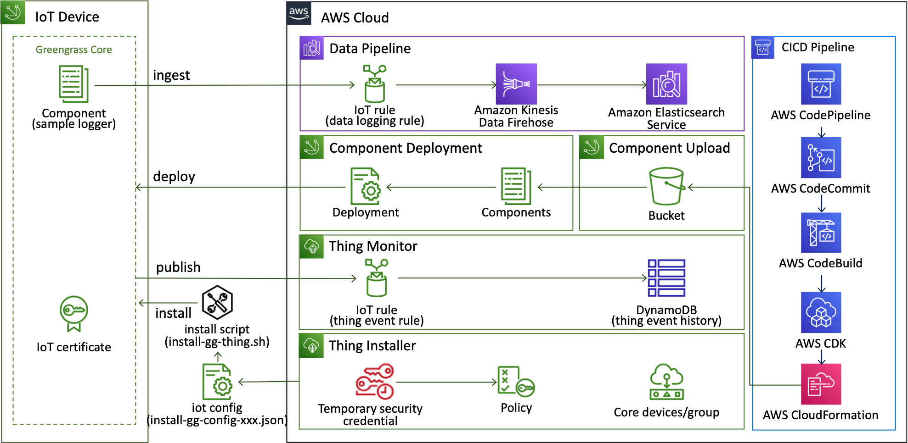

## CDK-Project Build & Deploy

To efficiently define and provision aws cloud resources, [AWS Cloud Development Kit(CDK)](https://aws.amazon.com/cdk) which is an open source software development framework to define your cloud application resources using familiar programming languages is utilized.


Because this solusion is implemented in CDK, we can deploy these cloud resources using CDK CLI. Among the various languages supported, this solution used typescript. Because the types of **typescript** are very strict, with the help of auto-completion, typescrip offers a very nice combination with AWS CDK.

***Caution***: This solution contains not-free tier AWS services. So be careful about the possible costs.

### **Prerequisites**

First of all, AWS Account and IAM User is required. And then the following modules must be installed.

- AWS CLI: aws configure --profile [profile name]
- Node.js: node --version
- AWS CDK: cdk --version
- [jq](https://stedolan.github.io/jq/): jq --version

Please refer to the kind guide in [CDK Workshop](https://cdkworkshop.com/15-prerequisites.html).

### ***Configure AWS Credential***

```bash
aws configure --profile [your-profile] 
AWS Access Key ID [None]: xxxxxx
AWS Secret Access Key [None]:yyyyyyyyyyyyyyyyyyyyyyyyyyyyyy
Default region name [None]: us-east-2 
Default output format [None]: json
    
aws sts get-caller-identity --profile [your-profile]
...
...
{
    "UserId": ".............",
    "Account": "75157*******",
    "Arn": "arn:aws:iam::75157*******:user/[your IAM User ID]"
}
```

### ***Check cdk project's default launch config***

The `cdk.json` file tells CDK Toolkit how to execute your app.

### ***Set up deploy config***

The `config/app-config-demo.json` files tell how to configure deploy condition & stack condition. First of all, change project configurations(Account, Profile are essential) in ```config/app-config-demo.json```.

```json
{
    "Project": {
        "Name": "IotData",
        "Stage": "Demo",
        "Account": "75157*******",
        "Region": "us-east-2",
        "Profile": "cdk-demo"
    },
    ...
    ...
}
```

And then set the path of the configuration file through an environment variable.

```bash
export APP_CONFIG=config/app-config-demo.json
```

### ***Install dependecies & Bootstrap***

```bash
sh ./script/setup_initial.sh config/app-config-demo.json
```

### ***Pack IoT Greengrass components***

```bash
sh ./script/pack_components.sh config/app-config-demo.json
```

Check whether ***zip*** directory and file are created in ***codes/component/logger_sample***.

### ***Deploy stacks(1st provisioning: without Firehose to ES)***

Before deployment, check whether all configurations are ready. Please execute the following command.

```bash
cdk list
...
...
==> CDK App-Config File is config/app-config-demo.json, which is from Environment-Variable.
==> Repository Selection:  CodeCommit
IotDataDemo-CicdPipelineStack
IotDataDemo-DataPipelineStack
IotDataDemo-ComponentDeploymentStack
IotDataDemo-ComponentUploadStack
IotDataDemo-ThingInstallerStack
IotDataDemo-ThingMonitorStack
```

Check if you can see the list of stacks as shown above.

If there is no problem, finally run the following command.

```bash
sh ./script/deploy_stacks.sh config/app-config-demo.json
```

### ***Deploy stacks(2nd provisioning: with Firehose to ES)***

For access Elasticsearch, we need to set up ```Role Mapping``` in Elasticsearch(Kibana).

First of all log in Kibana, you can find ID/PW in ```SecreteManager``` like this.

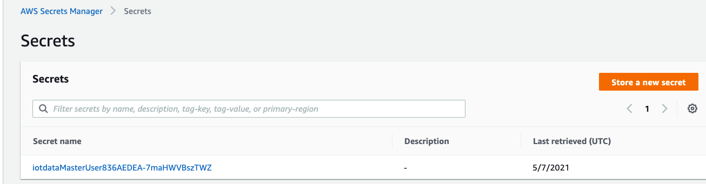

And then, add ```backend role``` in Kibana-Security like this, your role arn looks like this.
```arn:aws:iam::75157*******/IotDataDemo-Firehose2ESRole```

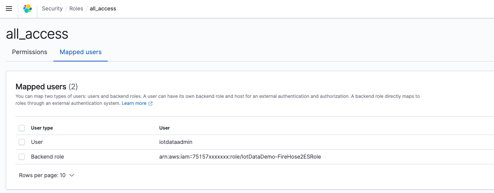

Enable a IoT rule option(***IoTRuleEnable***) in ***config/app-config-demo.json*** for Firehose-ES like this.

```json
...
...
    "DataPipeline": {
        "Name": "DataPipelineStack",

        "IoTRuleEnable": true, <----- enable this value
        "IoTRuleTopic": "$aws/rules",
        "IoTRuleTopic-Desc": "https://docs.aws.amazon.com/iot/latest/developerguide/iot-basic-ingest.html",
        "IoTRuleNameFirehoseIngestion": "firehose_ingestion",

        "DomainName": "iot-data",
        "MasterUserName": "iotdataadmin",
        "ESConditionAddress": [],
        "ElasticsearchSelection": "DEVELOP",
        "ElasticsearchCandidate": {
            "DEVELOP": {
            },
            "CUSTOM": {
                "VolumeSize": 40,
                "AZCount": 3,
                "MasterNodeCount": 3,
                "MasterNodeType": "r5.large.elasticsearch",
                "DataNodeCount": 3,
                "DataNodeType": "r5.large.elasticsearch"
            },
            "LEGACY": {
                "DomainEndpoint": ""
            }
        }
    },
...
...
```

Finally run the following command.

```bash
sh ./script/deploy_stacks.sh config/app-config-demo.json
```

You can check the deployment results as shown in the following picture.

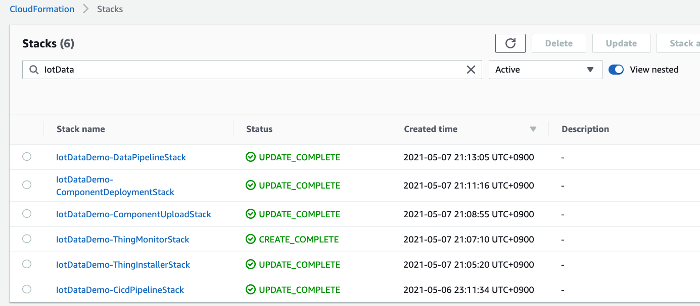

You can also check that the rules are registered.

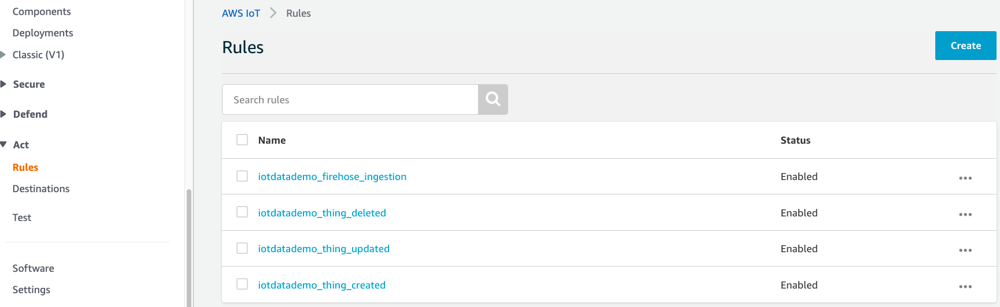

### ***Destroy stacks***

Execute the following command, which will destroy all resources except S3 Buckets and DynamoDB Tables. So destroy these resources in AWS web console manually.

```bash
sh ./script/destroy_stacks.sh config/app-config-demo.json
```

### ***CDK Useful commands***

- `npm install`     install dependencies
- `cdk list`        list up stacks
- `cdk deploy`      deploy this stack to your default AWS account/region
- `cdk diff`        compare deployed stack with current state
- `cdk synth`       emits the synthesized CloudFormation template

## How to install thing

### Generate `install-gg-config-[ProjectPrefix].json`

Please prepare `install-gg-config-[ProjectPrefix]`.json file, where ***[ProjectPrefix]*** is "Project Name" + "Project Stage" in ***app-config-demo.json***. For example, ***IotDataDemo*** is [ProjectPrefix] in this default ***app-config-demo.json***.

```bash
sh script/deploy_stacks.sh config/app-config-demo.json # generated-> script/thing/outout-thing-installer-stack-[ProjectPrefix].json
python3 script/thing/generate-install-gg-config.py -a config/app-config-demo.json -t script/thing/outout-thing-installer-stack-[ProjectPrefix].json # generated-> script/thing/install-gg-config-[ProjectPrefix].json
```

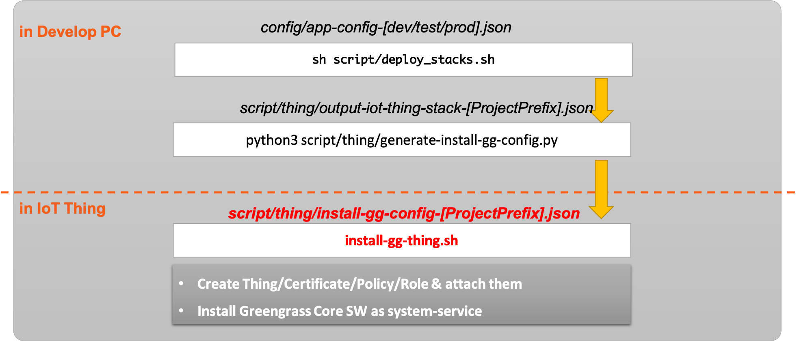

Check whether ***install-gg-config-[ProjectPrefix].json*** is created in ***script/thing*** directory.

### Transfer a config file into target device and execute a script in target devices

- ```script/thing/install-gg-config-[ProjectPrefix].json```
- ```script/thing/install-gg-thing.sh```

### Install Greengrass

#### 1. Update a unique thing name in ***install-gg-config-[ProjectPrefix].json***

```bash
{
    "IotDataDemo-ThingInstallerStack": {
        "OutputThingNamePrefix": "demo-thing-ver01-001", <--- append a extra & unique suffix thing name !!
        "OutputIoTTokenRoleAlias": "IotDataDemo-GreengrassV2TokenExchangeRoleAlias",
        "OutputInstallerTempRoleARN": "arn:aws:iam::75157*******:role/IotDataDemo-InstallerTempRole",
        "OutputThingGroupName": "demo-thing",
        "OutputIoTTokenRole": "IotDataDemo-GreengrassV2TokenExchangeRole",
        "OutputProjectRegion": "us-east-2",
        "OutputProjectPrefix": "IotDataDemo"
    },
    "Credentials": {
        "AccessKeyId": "xxxxxxxxxxx",
        "SecretAccessKey": "xxxxxxxxxxxxxxxxxxxxxxxxx",
        "SessionToken": "FwoGZXIvYXdzELn//////////xxxxxxxxxxxxxxxxxxxxxxxxxxxxxxxxxxxxxxxxxxxxxxxxxxxxxxxxxxxxxxxxxxxxxxxxxxxxxxxxxxxxxxxxxxxxxxxxxxxx",
        "Expiration": "2021-05-06 16:16:19+00:00"
    },
    "ProjectPrefix": "IotDataDemo"
}
```

#### 2. Run the following commands

```bash
sudo sh ./install-gg-thing.sh install-gg-config-[ProjectPrefix].json
```

Result of install-script

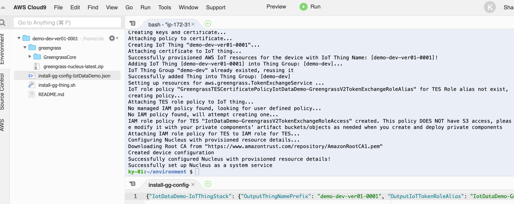

Result of Greengrass-installation

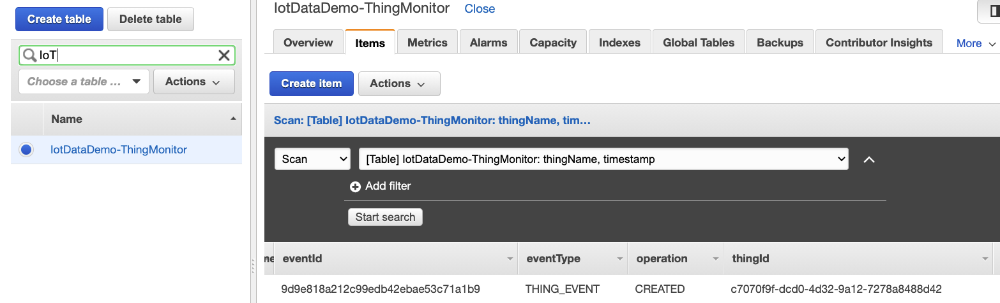

Result of Greengrass-deployment

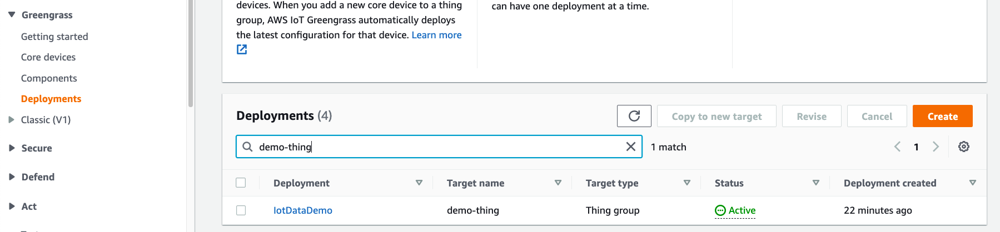

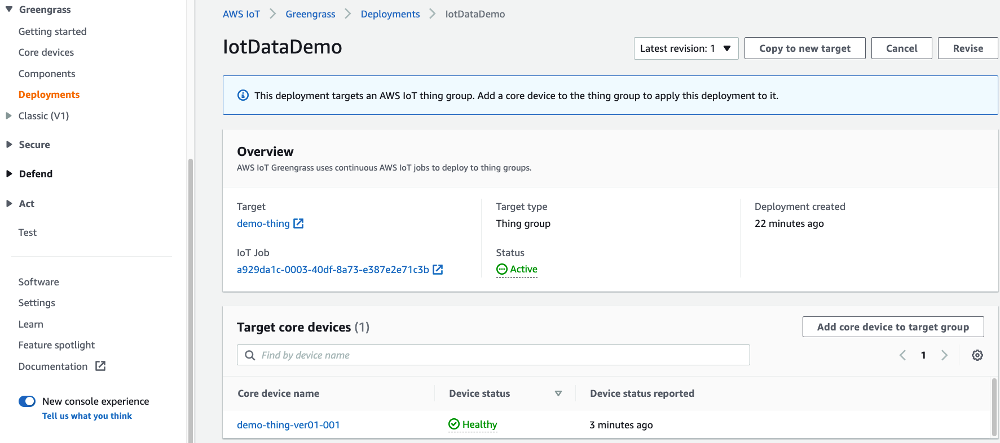

### Check greengrass system-service

```bash
sudo systemctl status greengrass
```

Result of Greengrass-service

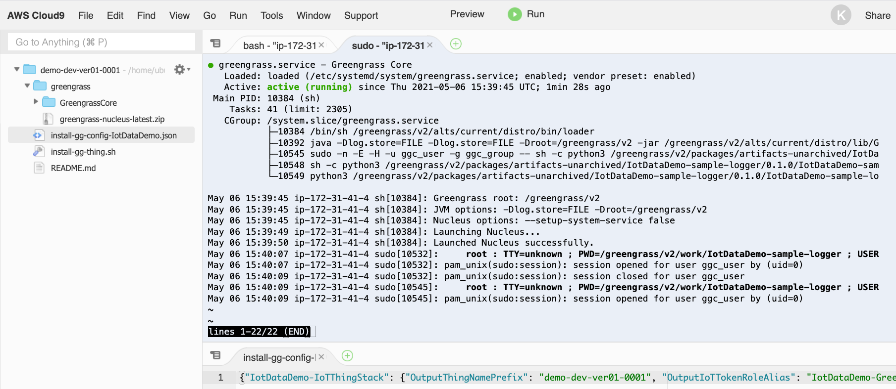

### Check greengass log

```bash
sudo tail -f /greengrass/v2/logs/greengrass.log
sudo tail -f /greengrass/v2/logs/com.xxx.xxx.xxx.log
```

Result of Greengrass-log

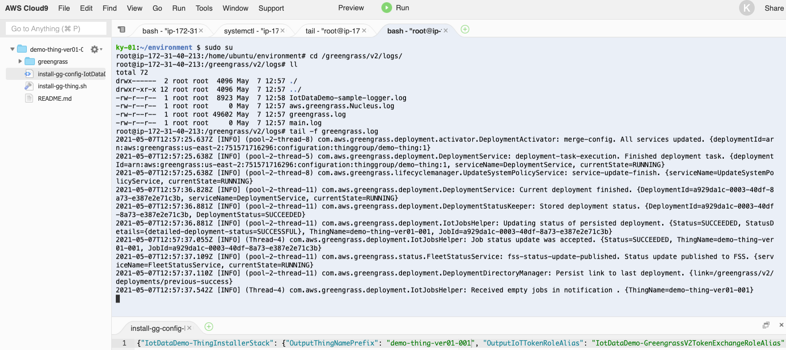

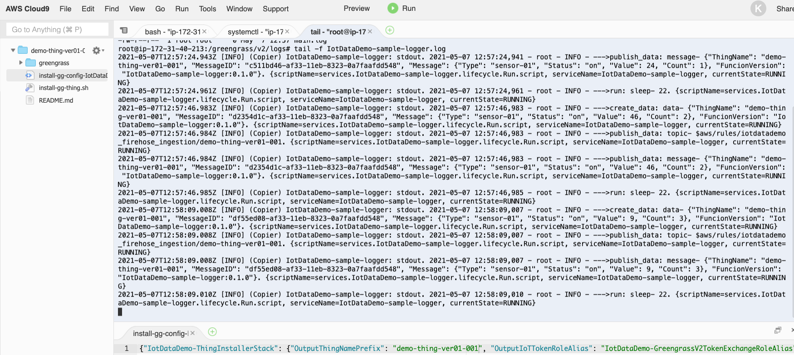

### How to uninstall greengrass in the device

```bash
sudo systemctl stop greengrass.service && sudo systemctl disable greengrass.service
sudo rm /etc/systemd/system/greengrass.service
sudo systemctl daemon-reload && sudo systemctl reset-failed
sudo rm -rf /greengrass
```

### trouble shooting

If you experience any of the following, re-deploy ComponentDeploymentStack after updating the component's version. This phenomenon occurs because the binary of the component is changed but the version is not changed.

```log
2022-04-08T09:58:17.381Z [INFO] (pool-2-thread-8) com.aws.greengrass.componentmanager.ComponentManager: prepare-package-start. {packageIdentifier=IotDataDemo-sample-logger-v0.1.1}
2022-04-08T09:58:17.968Z [INFO] (pool-2-thread-8) com.aws.greengrass.tes.CredentialRequestHandler: Received IAM credentials that will be cached until 2022-04-08T10:53:17Z. {iotCredentialsPath=/role-aliases/IotDataDemo-GreengrassV2TokenExchangeRoleAlias/credentials}
2022-04-08T09:58:18.512Z [INFO] (pool-2-thread-8) com.aws.greengrass.componentmanager.builtins.S3Downloader: download-artifact. task failed and will be retried. {task-attempt=1, componentIdentifier=IotDataDemo-sample-logger, artifactUri=s3://iotdatademo-gg-comp-upload-us-east-2-75157/deployment/IotDataDemo-sample-logger/0.1.1/IotDataDemo-sample-logger.zip}
com.aws.greengrass.componentmanager.exceptions.ArtifactChecksumMismatchException: Integrity check for downloaded artifact failed. Probably due to file corruption.
        at com.aws.greengrass.componentmanager.builtins.ArtifactDownloader.lambda$download$0(ArtifactDownloader.java:133)
        at com.aws.greengrass.util.RetryUtils.runWithRetry(RetryUtils.java:50)
        at com.aws.greengrass.componentmanager.builtins.ArtifactDownloader.download(ArtifactDownloader.java:121)
        at com.aws.greengrass.componentmanager.ComponentManager.prepareArtifacts(ComponentManager.java:430)
        at com.aws.greengrass.componentmanager.ComponentManager.preparePackage(ComponentManager.java:377)
        at com.aws.greengrass.componentmanager.ComponentManager.lambda$preparePackages$1(ComponentManager.java:338)
        at java.base/java.util.concurrent.FutureTask.run(FutureTask.java:264)
        at java.base/java.util.concurrent.ThreadPoolExecutor.runWorker(ThreadPoolExecutor.java:1128)
        at java.base/java.util.concurrent.ThreadPoolExecutor$Worker.run(ThreadPoolExecutor.java:628)
        at java.base/java.lang.Thread.run(Thread.java:829)
```

## How to check realtime data in Kibana

First of all, register ```index pattern``` like this.

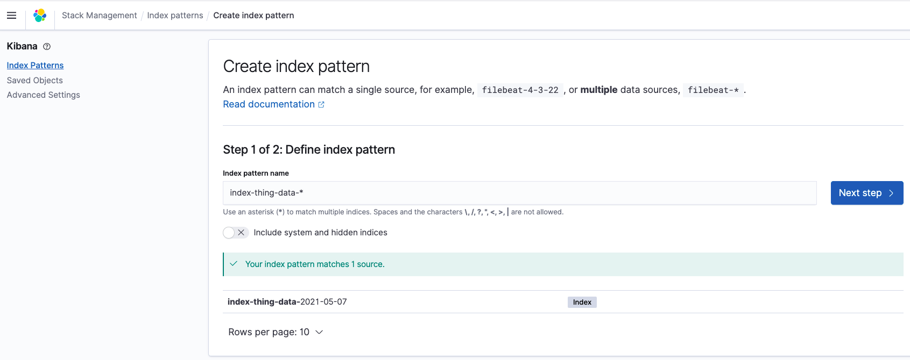

And then, check whether the new datas are uploaded like this.

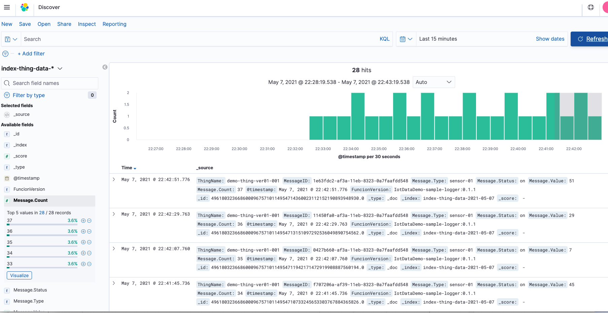

## How to update data-collector lambda

A Greengrass component is deployed with Greengrass's deployments. Please update component code(in `codes/component/logger_sample`) to customize your logging logic.

Note that when code changes are made, be sure to increase component's version in ```config/app-config-demo.json``` and then re-create the zip file in ```codes/component/logger_sample/zip``` using the following command.

```bash
sh ./script/pack_components.sh config/app-config-demo.json
```

After updating your logic, just git push the changes! And then CICD pipeline will automatically deploy that through CodePipeline & Greengrass deployments.

Or you can directly deploy those in local-dev PC using AWS CDK CLI like this.

```bash
sh ./script/deploy_stacks.sh config/app-config-demo.json
```
